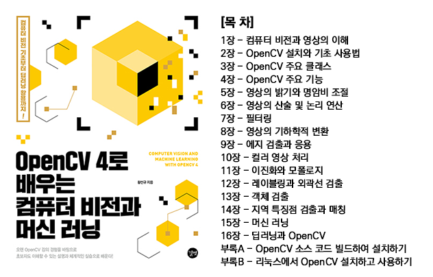

# 『OpenCV 4로 배우는 컴퓨터 비전과 머신 러닝』

『OpenCV 4로 배우는 컴퓨터 비전과 머신 러닝』(길벗, 2019) 책은 2019년 4월 12일에 출간되었습니다. 페이지 수는 576쪽이고, 목차는 다음과 같습니다.

## 예제 소스 코드 다운로드

* 프로젝트 폴더 및 파일을 웹으로 확인하려면 [[View on GitHub]](https://github.com/sunkyoo/opencv4cvml) 링크를 클릭하세요.
* 예제 소스 코드 전체를 다운로드 받으려면 [[Download .zip]](https://github.com/sunkyoo/opencv4cvml/zipball/master) 또는 [[Download .tar.gz]](https://github.com/sunkyoo/opencv4cvml/tarball/master) 링크를 클릭하세요.

## 관련 동영상

책에서 설명하지 않은 Visual Studio 설치 방법과 초보자가 따라하기 어려울 수 있는 내용을 선별하여 동영상 강의를 제공합니다.

* Visual Studio 2017 설치하기  [[동영상]](https://youtu.be/jzVNiMeVcvs){:target="_blank"}
* OpenCV 설치 실행 파일로 설치하기  [[동영상]](https://youtu.be/HxDfGHwDSmc){:target="_blank"}
* OpenCV 프로젝트 만들기: HelloCV  [[동영상]](https://youtu.be/fKWQIPwNsc8){:target="_blank"}
* 영상을 화면에 출력하기  [[동영상]](https://youtu.be/gcgScMU0XWE){:target="_blank"}
* OpenCV 소스 코드 빌드하여 설치하기  [[동영상]](https://youtu.be/ac75cFPYlOQ){:target="_blank"}
* 텐서플로로 필기체 인식 학습하고 OpenCV에서 사용하기  [[동영상]](https://youtu.be/4FLAp9nXlyo){:target="_blank"}
* 딥러닝 학습 모델을 가져와서 OpenCV에서 실행하기  [[동영상]](https://youtu.be/DteTXf4_pcA){:target="_blank"}
* 리눅스에서 OpenCV 설치하기  [[동영상]](https://youtu.be/3RcQf0hJdFM){:target="_blank"} / [[문서]](OpenCV4Linux.md){:target="_blank"}
* Visual Studio 2017 다운로드 방법 (2019년 6월 기준)  [[동영상]](https://youtu.be/SRzKtZBMIIY){:target="_blank"}

## 오프라인 강의

"OpenCV 4로 배우는 컴퓨터 비전과 머신 러닝" 책은 패스트캠퍼스에서 진행 중인 [[OpenCV로 배우는 컴퓨터 비전 프로그래밍]](https://www.fastcampus.co.kr/dev_camp_cvocv/){:target="_blank"} 강의 내용을 기반으로 출간되었습니다. 패스트캠퍼스 강의는 [[링크]](https://www.fastcampus.co.kr/dev_camp_cvocv/){:target="_blank"}를 참고하기 바랍니다.

## 오탈자 (Errata)

오탈자 목록은 추후 [[길벗]](https://www.gilbut.co.kr/book/view?bookcode=BN002402){:target="_blank"} 출판사에서 확인할 수 있습니다.
