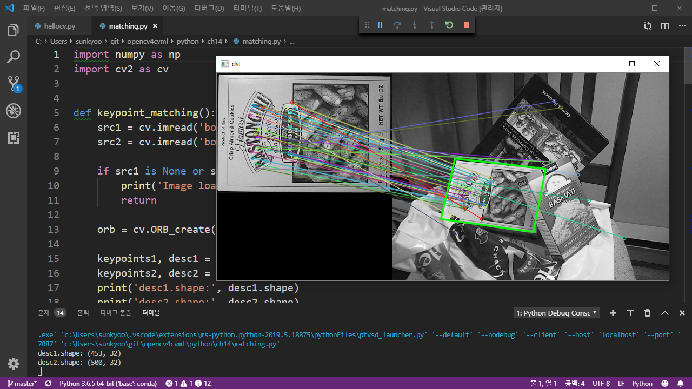

## 『OpenCV 4로 배우는 컴퓨터 비전과 머신 러닝』 파이썬 예제 코드

이 폴더에서는 『OpenCV 4로 배우는 컴퓨터 비전과 머신 러닝』(길벗, 2019) 책에 나오는 C/C++ 예제 프로그램을 파이썬(Python) 언어로 구현한 소스 코드를 제공합니다.

『OpenCV 4로 배우는 컴퓨터 비전과 머신 러닝』 책은 기본적으로 C/C++ 언어를 이용하여 OpenCV 라이브러리를 사용하는 방법을 설명합니다. 그러나 최근 OpenCV를 파이썬(Python) 언어로 사용하는 분들이 크게 늘어나고 있어서, 파이썬 사용자 분들도 이 책을 충분히 활용할 수 있도록 예제 프로그램을 파이썬 언어로 새롭게 구현한 소스 코드를 제공합니다. 파이썬 소스 코드에 대한 자세한 설명은 따로 제공하지 않지만 파이썬 언어 특성 상 누구나 쉽게 이해할 수 있을 것입니다. (책 본문에서 설명하는 Mat 클래스, Scalar 클래스 사용법 등 C/C++ 언어에 특화된 내용은 파이썬 예제로 제공하지 않습니다.)

## 테스트 환경 및 요구사항

* Python (3.6.5)
    * numpy (1.14.5)
    * matplotlib (2.2.2)
* opencv-python (4.1.0.25)
    ```bash
    pip install opencv-python
    ```
* Tensorflow (1.13.1)
    ```bash
    pip install tensorflow
    ```

## 하위 폴더 주제

* ch02 OpenCV 설치와 기초 사용법
* ch03 OpenCV 주요 클래스
* ch04 OpenCV 주요 기능
* ch05 영상의 밝기와 명암비 조절
* ch06 영상의 산술 및 논리 연산
* ch07 필터링
* ch08 영상의 기하학적 변환
* ch09 에지 검출과 응용
* ch10 컬러 영상 처리
* ch11 이진화와 모폴로지
* ch12 레이블링과 외곽선 검출
* ch13 객체 검출
* ch14 지역 특징점 검출과 매칭
* ch15 머신 러닝
* ch16 딥러닝과 OpenCV

## 스크린샷


