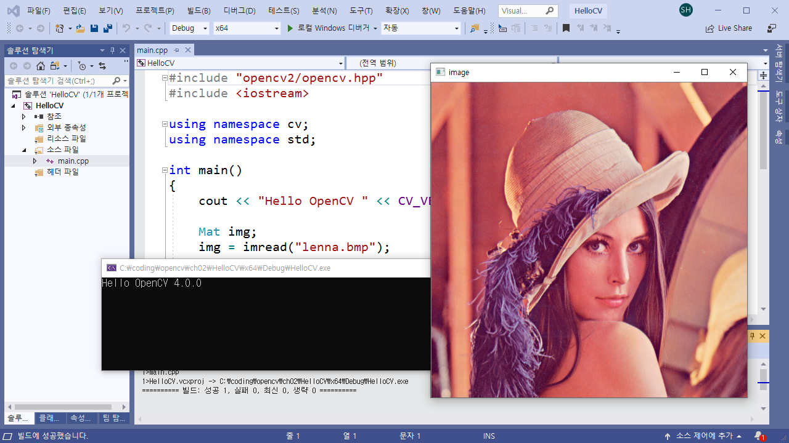

# 『OpenCV 4로 배우는 컴퓨터 비전과 머신 러닝』

## Visual Studio 2019 예제 소스 코드

『OpenCV 4로 배우는 컴퓨터 비전과 머신 러닝』 책은 기본적으로 Visual Studio 2017을 이용하는 예제 프로젝트 파일을 제공합니다. 2019년 6월에 Visual Studio 2019 버전이 새로 출시되었기에, Visual Studio 2019 사용자를 위한 예제 프로젝트 파일과 솔루션 파일을 새롭게 제공합니다. 기존의 예제 프로젝트에서 소스 코드는 완전히 동일하며, 프로젝트 파일과 솔루션 파일만 Visual Studio 2019 버전에 맞게 수정되었습니다.

## 스크린샷

